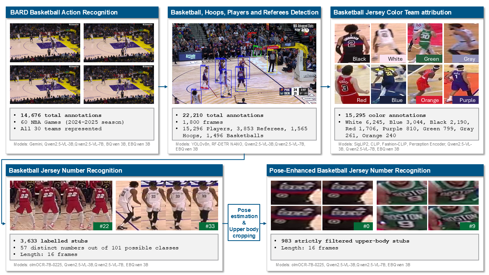

# 🎽🔢⛹️‍♀️🏀👁️ E-BARD: A Multi-Task Extension of the Basketball Action Recognition Dataset for Player Detection, Team Attribution and Jersey Number Recognition 👁️🏀⛹️‍♀️🔢🎽

## 📄 Abstract

This work builds upon the Basketball Action Recognition Dataset (BARD), originally introduced to enable supervised learning for primary action recognition in NBA game footage. However, BARD's initial design lacks the granular annotations required to develop multi-stage computer vision pipelines involving object detection, jersey number recognition (JNR) and team attribution. To address these limitations, we present E-BARD (Extended Basketball Action Recognition Dataset), which bridges the gap between isolated action recognition and end-to-end scene-level reasoning through three key contributions.

First, we introduce a new set of interrelated datasets that augment the original BARD videos with dense visual annotations. This includes detection data for key entities (ball, hoop, referee, player), team attribution based on uniform colors and JNR, all integrated to directly support and enrich the original action captions. Second, we establish a comprehensive benchmark for these specific visual understanding tasks using representative state-of-the-art models. We evaluate YOLO and RF-DETR for object detection; CLIP, SigLIP2, FashionCLIP, and the Perception Encoder for team color attribution; and olmOCR, Qwen2.5-VL-3B, and Qwen2.5-VL-7B for JNR. Finally, we propose a holistic, integrated approach based on Qwen2.5-VL, demonstrating the capacity of a unified multimodal framework to jointly address all subtasks simultaneously. Ultimately, E-BARD provides a comprehensive benchmark for multi-task basketball video understanding.

## 🎆 E-BARD at a glance 🎇



## 💾 Data Download

### 1️⃣ Object Classification
```bash
git clone https://huggingface.co/datasets/GabrieleGiudici/E-BARD-ObjectClassification obj_classification/data
cd obj_classification/data
git lfs install
git lfs pull
unzip all.zip
cd ../../
```

### 2️⃣ Team Attribution
```bash
git clone https://huggingface.co/datasets/GabrieleGiudici/E-BARD-TeamAttribution team_attribution/data
cd team_attribution/data
git lfs install
git lfs pull
unzip all.zip
cd ../../
```

### 3️⃣ Jersey Number Recognition
```bash
git clone https://huggingface.co/datasets/GabrieleGiudici/E-BARD-JerseyNumberRecognition jnr/data
cd jnr/data
git lfs install
git lfs pull
unzip all.zip
cd ../../
```

### 4️⃣ Object Detection
```bash
git clone https://huggingface.co/datasets/GabrieleGiudici/E-BARD-detection detection/data
cd detection/data
git lfs install
git lfs pull
unzip all.zip
cd ../../
```

### 5️⃣ Detection Models
```bash
git clone https://huggingface.co/GabrieleGiudici/E-BARD-detection-models detection/model
cd detection/model
git lfs install
git lfs pull
cd ../../
```

## 📘 Folders description
E-BARD is structured to support both isolated computer vision sub-tasks and holistic multimodal training.

- EBQwen_dataset/: The core directory housing all interleaved JSON dataset splits (train, validation, test) used for multi-task supervised fine-tuning. It integrates data for grounding, classification, OCR, and video understanding to train unified models like EBQwen 3B.
- action_recognition/: Contains the output for the multi-label action recognition task inherited from the original BARD multi-label clips.
- detection/: Hosts the object detection pipeline and baselines. This module leverages 22,210 object-level annotations across 1,800 frames to train and evaluate lightweight models like YOLOv8n and RF-DETR NANO for tracking basketballs, hoops, players, and referees.
- jnr/: The Jersey Number Recognition (JNR) module. It processes 3,633 16-frame player tracklets tracked via ByteTrack, and includes a pose-enhanced pipeline that strictly filters down to 983 upper-body stubs for improved legibility. This module evaluates VLMs like Qwen2.5-VL and olmOCR.
- team_attribution/: Handles the categorical analysis of team appearance based on 15,295 main jersey color annotations. Includes evaluation code for models like Fashion-CLIP, CLIP, and SigLIP2 to distinguish between 8 primary uniform colors.
- obj_classification/: Contains scripts and data for an additional sub-task that classifies previously detected entities into four predefined classes: basketball, hoop, player, and referee.
	
## 👩‍🔬 Validation
The validation metrics and evaluation results for the different subtasks addressed in E-BARD are isolated within their respective module directories. 
You can find the run outputs and metric logs at the following paths:

- Action Recognition: Evaluation metrics and output logs are located at .\E-BARD\action_recognition\metrics\run_output.txt

- Object Detection: Validation scripts and evaluation results for YOLO/RF-DETR are stored in .\E-BARD\detection\eval\

- Jersey Number Recognition (JNR): JNR evaluation results and metric summaries can be found in .\E-BARD\jnr\eval\

- Object Classification: Classification results and metric logs are generated at .\E-BARD\obj_classification\src\metrics\run_output.txt

- Team Attribution: Output data and validation results for team attribution are located in .\E-BARD\team_attribution\src\

## 🇮🇹🤝🇨🇳 How to get EBQwen2.5-VL-3B
Our BARD (re-worked) SFT version of Qwen2.5-VL-3B-Instruct is avialable here (branch E-BARD): https://huggingface.co/GabrieleGiudici/BQwen2.5-VL-3B.
Our BARD and E-BARD SFT version of Qwen2.5-VL-3B-Instruct is avialable here: https://huggingface.co/GabrieleGiudici/EBQwen2.5-VL-3B.
If you want to reproduce BQwen2.5-VL-3B/EBQwen2.5-VL-3B it is possible to use data from dataset/qwen together with referenced sft folder Qwen2.5-VL https://github.com/GabrieleGiudic/Qwen2.5-VL

## ⚠️ Note on File Paths
While best efforts have been made to generalize the file paths in this repository, all original computations and model training were executed on a remote computing cluster. As a result, you will likely need to update some of these paths to match your local directory structure before running the code.

## 🧑‍⚖️ License
This project is licensed under the [Creative Commons Attribution 4.0 International License](https://creativecommons.org/licenses/by/4.0/).
